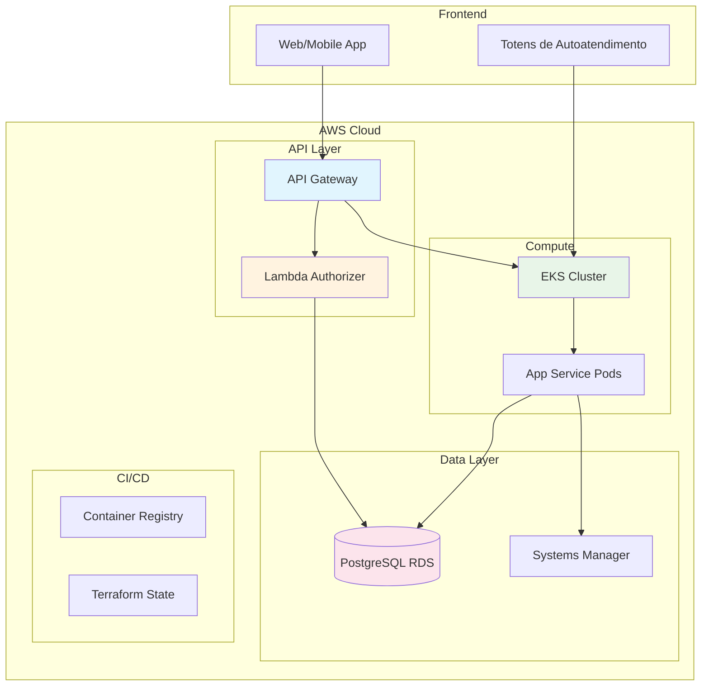
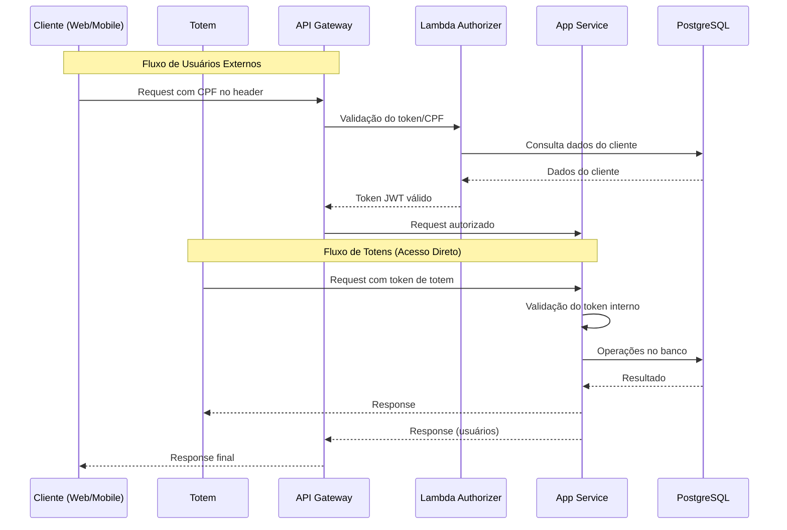
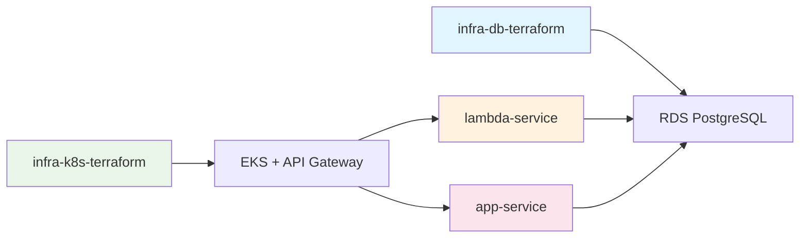
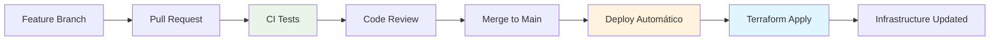

# 🍔 Sistema de Autoatendimento - Lanchonete

## 📖 Visão Geral do Projeto

Este projeto representa a **Fase 3** do desenvolvimento de um sistema completo de autoatendimento para lanchonetes, implementando melhorias significativas em arquitetura, segurança e práticas de desenvolvimento. O sistema utiliza tecnologias modernas de nuvem (AWS) e segue as melhores práticas de DevOps.

### 🎯 Principais Melhorias da Fase 3

- **🚪 API Gateway + Serverless**: Implementação de autenticação via Lambda com validação por CPF
- **🏗️ Arquitetura**: Segregação de códigos em repositórios especializados
- **⚙️ CI/CD Avançado**: Deploy automatizado com proteção de branches e uso de Terraform
- **🗄️ Banco de Dados Melhorado**: PostgreSQL com modelagem otimizada e documentação completa
- **☁️ Infraestrutura Cloud**: Utilização de serviços serverless e cloud da AWS

## 🏛️ Arquitetura do Sistema

### Diagrama Geral da Arquitetura



### Fluxo de Autenticação



## 📁 Estrutura de Repositórios

O projeto está organizado em **4 repositórios especializados**, cada um com responsabilidades específicas:

### 1. 🗄️ Infraestrutura do Banco de Dados

**Repositório**: `infra-db-terraform`

- **Função**: Provisionamento da infraestrutura de banco PostgreSQL RDS
- **Tecnologias**: Terraform, AWS RDS, Systems Manager
- **Responsabilidades**:
  - Configuração do PostgreSQL RDS Multi-AZ
  - Gerenciamento de credenciais via SSM
  - Backup automático e monitoramento
  - Configurações de segurança e rede

### 2. 🚀 Serviço Lambda

**Repositório**: `lambda-service`

- **Função**: Microserviço serverless para verificação de clientes
- **Tecnologias**: Node.js, TypeScript, Serverless Framework
- **Responsabilidades**:
  - Validação de CPF dos clientes
  - Consulta ao banco PostgreSQL
  - Integração com API Gateway

### 3. ☸️ Infraestrutura Kubernetes

**Repositório**: `infra-k8s-terraform`

- **Função**: Provisionamento do cluster EKS e API Gateway
- **Tecnologias**: Terraform, EKS, API Gateway, Lambda
- **Responsabilidades**:
  - Configuração do cluster EKS
  - Setup do API Gateway
  - Deploy do Lambda Authorizer
  - Configuração de rede e segurança

### 4. 🍔 Aplicação Principal

**Repositório**: `app-service`

- **Função**: API principal do sistema de autoatendimento
- **Tecnologias**: NestJS, TypeScript, TypeORM, Docker
- **Responsabilidades**:
  - Lógica de negócio do sistema
  - Gerenciamento de pedidos
  - Interface com totems
  - APIs RESTful

### Integração entre Repositórios



## ⚙️ CI/CD e Práticas DevOps

### Proteção de Branches

Todos os repositórios implementam proteção rigorosa da branch `main`:

- 🚫 **Push direto bloqueado**: Impossibilita commits diretos na main
- ✅ **Pull Request obrigatório**: Todas as mudanças passam por PR
- 🔍 **Code Review obrigatório**: Aprovação de pelo menos 1 revisor
- 🧪 **Testes obrigatórios**: CI/CD deve passar com sucesso
- 📋 **Status checks**: Validação de qualidade e segurança

### Pipeline de Deploy



### Tecnologias CI/CD

- **GitHub Actions**: Automação de workflows
- **Terraform**: Infrastructure as Code
- **Docker**: Containerização
- **AWS ECR**: Registry de containers
- **AWS S3 + DynamoDB**: State management do Terraform
- **Secrets Manager**: Gerenciamento seguro de credenciais

## 🛠️ Justificativas Técnicas

### Por que PostgreSQL?

#### 🎯 Robustez Técnica

- **ACID Compliant**: Garante consistência em transações críticas
- **Performance Superior**: Índices avançados e otimização automática
- **JSON Nativo**: Perfeito para APIs REST e dados semi-estruturados

#### ☁️ Integração AWS

- **RDS Gerenciado**: Backups automáticos, Multi-AZ e monitoramento
- **Escalabilidade**: Read replicas e particionamento
- **Segurança**: Criptografia integrada e controle granular

#### 🎓 Benefícios para Aprendizado

- **Open Source**: Sem custos de licença
- **Padrão da Indústria**: Amplamente usado em empresas de tecnologia
- **Microserviços-friendly**: Schemas múltiplos e isolamento por domínio

### Por que AWS?

- **🚀 Serverless**: Lambda para escalabilidade automática
- **🔐 Segurança**: IAM, Secrets Manager, VPC
- **📊 Monitoramento**: CloudWatch integrado
- **💰 Custo-benefício**: Pay-per-use para recursos serverless
- **🌍 Disponibilidade**: Multi-AZ e alta disponibilidade

### Por que Kubernetes (EKS)?

- **📈 Escalabilidade**: Auto-scaling baseado em métricas
- **🔄 Orquestração**: Gerenciamento automático de containers
- **🛡️ Isolamento**: Namespaces e network policies
- **🔧 Flexibilidade**: Deploy de aplicações complexas
- **📊 Observabilidade**: Integração com ferramentas de monitoramento

## 🗄️ Modelagem de Dados

### Esquema do Banco de Dados

Acesse o esquema completo do banco de dados através do link:
**[Esquema do Banco - BR Modelo](https://app.brmodeloweb.com/#!/publicview/68213be2acb39fc7c317bb53)**

### Estrutura Principal

O banco PostgreSQL foi modelado seguindo as melhores práticas de normalização e inclui:

- **Tabela de Clientes**: Informações dos usuários com validação de CPF
- **Tabela de Produtos**: Catálogo com categorias e preços
- **Tabela de Pedidos**: Controle de status e histórico
- **Tabela de Itens do Pedido**: Relacionamento many-to-many otimizado
- **Tabela de Totens**: Controle de dispositivos autorizados

### Características da Modelagem

- **🔐 Segurança**: Campos sensíveis criptografados
- **📊 Performance**: Índices otimizados para consultas frequentes
- **🔄 Integridade**: Constraints e foreign keys bem definidas
- **📈 Escalabilidade**: Estrutura preparada para crescimento

## 🎥 Demonstração

### Vídeo da Arquitetura

Assista à demonstração completa da arquitetura desenvolvida e execução das pipelines CI/CD:

**[youtube.com](youtube.com)**

O vídeo apresenta:

- 🏗️ **Arquitetura na AWS**: Visão completa dos serviços provisionados
- ⚙️ **Pipelines CI/CD**: Demonstração dos workflows automatizados
- 🔧 **Infraestrutura como Código**: Terraform em ação
- 🚀 **Deploy Automatizado**: Processo completo de deployment
- 🛡️ **Segurança**: Implementação de boas práticas

## 🚀 Como Executar

### Pré-requisitos

- AWS CLI configurado
- Terraform >= 1.0
- Docker
- kubectl
- Node.js 18+

### Ordem de Deploy

1. **Infraestrutura do Banco**: Deploy do `infra-db-terraform`
2. **Lambda Service**: Deploy do `lambda-service`
3. **Infraestrutura K8s**: Deploy do `infra-k8s-terraform`
4. **App Service**: Deploy do `app-service`

### Comandos Básicos

```bash
# 1. Clonar os repositórios
git clone <repositório-infra-db>
git clone <repositório-infra-k8s>
git clone <repositório-lambda>
git clone <repositório-app>

# 2. Deploy dos serviços
cd ../lambda-service
serverless deploy


# 3. Deploy da infraestrutura
cd infra-db-terraform
terraform init && terraform apply

cd ../infra-k8s-terraform
terraform init && terraform apply

# 4.Deploy da aplicação
cd ../app-service
docker build -t app-service .
kubectl apply -f k8s/
```
