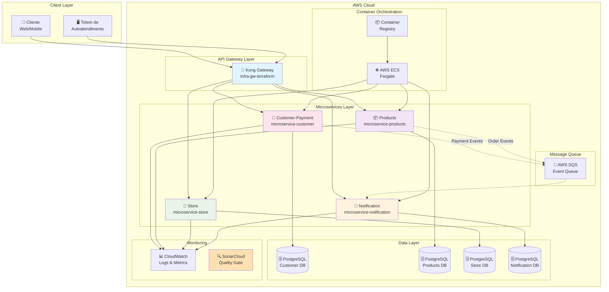
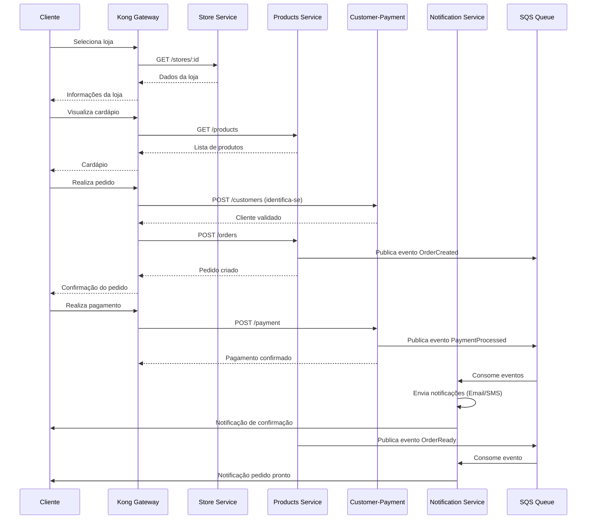
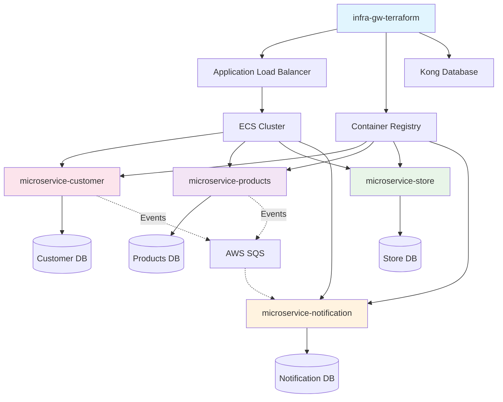
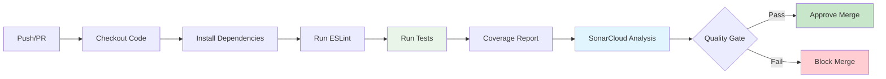
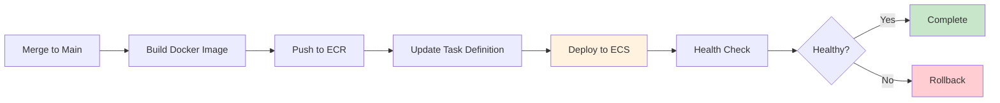
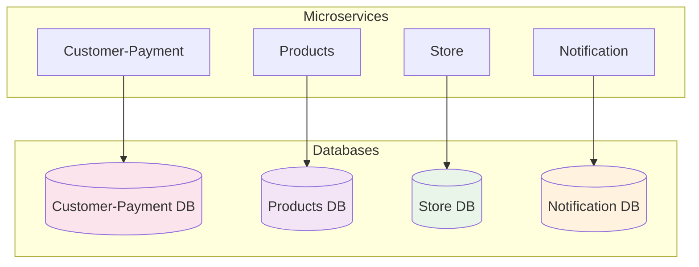
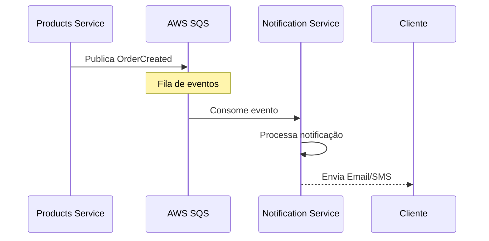

# 🍔 Sistema de Autoatendimento - Lanchonete | Tech Challenge Fase 4

[](https://github.com/FIAP-Tech-Challange)
[](https://github.com/FIAP-Tech-Challange)
[](https://github.com/FIAP-Tech-Challange)

## 📲 Equipe - Grupo 191

- davidasteixeira
- Gabriel Sahdo - RM364903
- Rafael - RM363594
- Thiago Luiz - RM364455

## 📖 Visão Geral do Projeto

Este projeto representa a **Fase 4** do desenvolvimento de um sistema completo de autoatendimento para lanchonetes, evoluindo para uma **arquitetura de microserviços moderna** com foco em escalabilidade, manutenibilidade e qualidade de código. O sistema utiliza tecnologias cloud-native da AWS e segue as melhores práticas de DevOps e Clean Architecture.

### 🎯 Principais Melhorias da Fase 4

- **🏗️ Arquitetura de Microserviços**: 4 microserviços independentes e especializados
- **🎨 Clean Architecture**: Separação clara de responsabilidades e domínios isolados
- **✅ Alta Cobertura de Testes**: Média com 663 testes
- **🔍 Qualidade de Código**: Integração com SonarCloud para análise contínua
- **🚀 CI/CD Avançado**: Pipelines automatizados com GitHub Actions
- **☁️ Cloud Native**: Infraestrutura moderna com ECS, RDS e Kong Gateway
- **📊 Monitoramento**: CloudWatch para observabilidade completa
- **🧪 BDD Testing**: Testes behavior-driven para validação de cenários [microservice-products](microservice-notification)

## 🏛️ Arquitetura do Sistema

### Diagrama Geral da Arquitetura



### Fluxo de Comunicação entre Microserviços



## 📁 Estrutura de Repositórios

O projeto está organizado em **5 repositórios especializados**, cada um com responsabilidades específicas seguindo princípios de microserviços:

### 1. 🚪 Kong Gateway - Infraestrutura

**Repositório**: `infra-gw-terraform`

- **Função**: API Gateway e infraestrutura compartilhada
- **Tecnologias**: Terraform, Kong Gateway, AWS ECS, RDS, ALB
- **Responsabilidades**:
  - Roteamento de requisições para microserviços
  - Load balancing e high availability
  - Container registry (ECR)
  - Secrets management
  - Configuração de rede (VPC, Security Groups)
- **Recursos Provisionados**:
  - Kong Gateway (Proxy, Admin, Manager)
  - Application Load Balancer
  - PostgreSQL RDS para Kong
  - ECR para imagens Docker
  - Secret Manager para JWT

### 2. 👥 Customer-Payment Microservice

**Repositório**: `microservice-customer`

- **Função**: Gestão de clientes e processamento de pagamentos
- **Tecnologias**: NestJS, TypeScript, TypeORM, PostgreSQL, Docker
- **Domínios**:
  - **Customer**: Cadastro, validação de CPF, consultas
  - **Payment**: Transações, webhooks, status tracking
- **Responsabilidades**:
  - Autenticação e identificação de clientes
  - Validação de CPF (Value Object)
  - Processamento de pagamentos
  - Integração com gateways externos
  - Webhooks para confirmação
- **Quality Gate**: ✅ SonarCloud Configurado

### 3. 📦 Products Microservice

**Repositório**: `microservice-products`

- **Função**: Gestão de produtos, categorias e pedidos
- **Tecnologias**: NestJS, TypeScript, TypeORM, PostgreSQL, Cucumber (BDD)
- **Domínios**:
  - **Products**: CRUD de produtos, preços
  - **Categories**: Hierarquia de categorias
  - **Orders**: Fluxo de pedidos com estados
- **Responsabilidades**:
  - Catálogo de produtos
  - Gerenciamento de categorias
  - Criação e rastreamento de pedidos
  - Estados: PENDING → RECEIVED → IN_PROGRESS → READY → FINISHED
  - Publicação de eventos (OrderCreated, OrderReady)
- **Quality Gate**: ⚠️ SonarCloud em configuração

### 4. 🏪 Store Microservice

**Repositório**: `microservice-store`

- **Função**: Gerenciamento de lojas/estabelecimentos
- **Tecnologias**: NestJS, TypeScript, TypeORM, PostgreSQL, Docker
- **Responsabilidades**:
  - Cadastro de lojas
  - Configurações operacionais
  - Horários de funcionamento
  - Multi-tenancy support
  - Métricas de performance
- **Quality Gate**: ⚠️ SonarCloud em configuração

### 5. 🔔 Notification Microservice

**Repositório**: `microservice-notification`

- **Função**: Sistema de notificações multi-canal
- **Tecnologias**: NestJS, TypeScript, AWS SES, SNS, SQS, Firebase
- **Arquitetura**: Event-Driven com filas de mensagens
- **Canais Suportados**:
  - 📧 Email (AWS SES, SendGrid, SMTP)
  - 📱 SMS (AWS SNS, Twilio)
  - 🔔 Push (Firebase, OneSignal)
  - 🔗 Webhooks
- **Responsabilidades**:
  - Processamento assíncrono de eventos
  - Gerenciamento de templates
  - Retry mechanism para falhas
  - Histórico e auditoria
  - Multi-idioma
- **Quality Gate**: ⚠️ SonarCloud em configuração

### Integração entre Repositórios



## 📊 Métricas de Qualidade

### Resumo Geral

| Métrica             | Valor       | Status |
| ------------------- | ----------- | ------ |
| **Microserviços**   | 4           | ✅     |
| **Cobertura Média** | 93.5%       | ✅     |
| **Total de Testes** | 663         | ✅     |
| **Testes Passando** | 663 (100%)  | ✅     |
| **Quality Gates**   | configurado | ✅     |

### Detalhamento por Microserviço

| Microserviço     | Cobertura | Testes | Suites | SonarCloud     | CI/CD    |
| ---------------- | --------- | ------ | ------ | -------------- | -------- |
| customer-payment | 88.14%    | 131    | 10     | ✅ Configurado | ✅ Ativo |
| products         | 96%+      | 111    | 18     | ✅ Configurado | ✅ Ativo |
| store            | 93.87%    | 90     | -      | ✅ Configurado | ✅ Ativo |
| notification     | 95.86%    | 331    | -      | ✅ Configurado | ✅ Ativo |

### Cobertura Detalhada

- **Statements**: 88-97%
- **Branches**: 76-80%
- **Functions**: 90-100%
- **Lines**: 89-97%

### Tipos de Testes

- ✅ **Testes Unitários**: Cobertura de entidades, casos de uso e value objects
- ✅ **Testes de Integração**: Controllers, repositories e serviços externos
- ✅ **Testes BDD**: 4 cenários Cucumber no microserviço products
- ✅ **Testes de Value Objects**: Validação de CPF, Email, Phone

## 🎓 Stack Tecnológico

### Backend

- **Framework**: NestJS 10.x
- **Linguagem**: TypeScript 5.9.3
- **Arquitetura**: Clean Architecture (Hexagonal)
- **ORM**: TypeORM com PostgreSQL
- **Testes**: Jest 29.5.0
- **BDD**: Cucumber (products microservice)
- **Validação**: Class-validator, Class-transformer

### Infraestrutura

- **Cloud Provider**: AWS
- **Container Orchestration**: ECS com Fargate
- **API Gateway**: Kong Gateway
- **Load Balancer**: Application Load Balancer (ALB)
- **Database**: PostgreSQL 14-15 (RDS)
- **Message Queue**: AWS SQS
- **Email Service**: AWS SES
- **SMS Service**: AWS SNS
- **Container Registry**: AWS ECR
- **Secrets**: AWS Parameter Store / Secrets Manager
- **IaC**: Terraform
- **Monitoring**: CloudWatch + SonarCloud

### Qualidade & DevOps

- **Code Quality**: ESLint + Prettier
- **Security**: SonarCloud (SAST)
- **Coverage**: Jest with lcov reports
- **CI/CD**: GitHub Actions
- **Branch Protection**: Pull Request obrigatório com code review
- **Documentation**: Swagger/OpenAPI 3.0

### Serviços AWS Utilizados

- **ECS** (Elastic Container Service) - Orquestração
- **ECR** (Elastic Container Registry) - Docker images
- **RDS** (Relational Database Service) - PostgreSQL
- **ALB** (Application Load Balancer) - Balanceamento
- **SQS** (Simple Queue Service) - Filas de mensagens
- **SES** (Simple Email Service) - Email
- **SNS** (Simple Notification Service) - SMS
- **CloudWatch** - Logs e métricas
- **Parameter Store** - Gerenciamento de configurações
- **Secrets Manager** - Gerenciamento de secrets

## ⚙️ CI/CD e Práticas DevOps

### Pipeline de Integração Contínua



### Pipeline de Deploy



### Proteção de Branches

Todos os repositórios implementam proteção rigorosa:

- 🚫 **Push direto bloqueado**: Impossibilita commits diretos na main
- ✅ **Pull Request obrigatório**: Todas as mudanças passam por PR
- 🔍 **Code Review obrigatório**: Aprovação de pelo menos 1 revisor
- 🧪 **Testes obrigatórios**: CI deve passar com 100% de sucesso
- 📋 **Status checks**: ESLint + Testes + SonarCloud
- 🏷️ **Branch naming**: feature/_, hotfix/_, bugfix/\*

### Workflows GitHub Actions

Cada microserviço possui workflows padronizados:

#### 1. CI Workflow (ci.yml)

- **Triggers**: Pull Request, Push para main/develop
- **Jobs**:
  1. **test**: Instalação, lint, testes com coverage
  2. **sonarqube**: Análise de qualidade (aguarda test)
- **Outputs**: Coverage report, análise SonarCloud

#### 2. Deploy Workflow (deploy.yml ou app.yml)

- **Triggers**: Push para main, workflow_dispatch
- **Dependencies**: Aguarda sucesso do CI
- **Steps**:
  1. Build da imagem Docker
  2. Push para ECR
  3. Update ECS task definition
  4. Deploy no ECS
  5. Health check

## 🏗️ Clean Architecture

Todos os microserviços seguem os princípios de Clean Architecture:

### Estrutura de Camadas

```
app/src/
├── common/                    # Elementos compartilhados
│   ├── DTOs/                 # Data Transfer Objects
│   ├── dataSource/           # Interfaces de acesso a dados
│   └── exceptions/           # Exceções customizadas
├── core/                     # 🎯 CAMADA INTERNA - Regras de Negócio
│   ├── common/              # Value Objects e utilitários
│   └── modules/             # Domínios da aplicação
│       └── {domain}/
│           ├── entities/    # Entidades de domínio
│           ├── useCases/    # Casos de uso (regras de negócio)
│           ├── gateways/    # Interfaces (ports)
│           ├── DTOs/        # Contratos de entrada/saída
│           └── mappers/     # Transformação de dados
└── external/                # 🌐 CAMADA EXTERNA - Adaptadores
    ├── consumers/           # APIs (NestJS controllers)
    └── dataSources/         # Implementação de persistência
```

### Princípios Aplicados

- **🔄 Dependency Inversion**: Core não depende de frameworks
- **🧪 Testabilidade**: Regras de negócio isoladas
- **🔌 Framework Independence**: Lógica desacoplada do NestJS
- **📱 UI Independence**: API pode ser consumida por qualquer cliente
- **🗄️ Database Independence**: Uso de interfaces para persistência
- **🎯 Single Responsibility**: Cada camada tem uma responsabilidade clara

## 🗄️ Estratégia de Banco de Dados

### Database per Service Pattern

Cada microserviço possui seu próprio banco de dados:



### Características

- **🔐 Isolamento de Dados**: Cada serviço é dono de seus dados
- **📈 Escalabilidade Independente**: Diferentes estratégias de scaling
- **🛡️ Resiliência**: Falha em um DB não afeta outros serviços
- **🔄 Autonomia**: Times podem evoluir schemas independentemente
- **💾 Backups Isolados**: Estratégias de backup por serviço

### Tecnologias de Persistência

- **RDBMS**: PostgreSQL 14-15 (RDS Multi-AZ)
- **ORM**: TypeORM com migrations automatizadas
- **Connection Pooling**: Configurado por serviço
- **Indexes**: Otimizados para queries principais
- **Constraints**: Foreign keys e validações no DB

## 🔔 Comunicação entre Microserviços

### Padrões de Comunicação

#### 1. Síncrono via Kong Gateway

```
Cliente → Kong Gateway → Microserviço → Resposta
```

- **Uso**: Operações CRUD, consultas diretas
- **Protocolo**: HTTP/REST
- **Timeout**: Configurável por rota

#### 2. Assíncrono via Event Queue

```
Microserviço → SQS → Notification Service
```

- **Uso**: Notificações, processamento em background
- **Eventos**:
  - `PaymentProcessed` (Customer-Payment)
  - `OrderCreated` (Products)
  - `OrderReady` (Products)
  - `OrderCancelled` (Products)

### Event-Driven Architecture



## 🚀 Como Executar

### Pré-requisitos

- **Docker** 20+ e **Docker Compose**
- **Node.js** 20-22
- **AWS CLI** configurado
- **Terraform** >= 1.0
- **kubectl** (opcional, para ECS)
- **Git**

### Execução Local

#### 1. Clonar Repositórios

```bash
# Infraestrutura
git clone https://github.com/FIAP-Tech-Challange/infra-gw-terraform.git

# Microserviços
git clone https://github.com/FIAP-Tech-Challange/microservice-customer.git
git clone https://github.com/FIAP-Tech-Challange/microservice-products.git
git clone https://github.com/FIAP-Tech-Challange/microservice-store.git
git clone https://github.com/FIAP-Tech-Challange/microservice-notification.git
```

#### 2. Executar um Microserviço Localmente

```bash
# Exemplo: Customer-Payment
cd microservice-customer/app

# Configurar variáveis de ambiente
cp env-example .env
# Editar .env com suas configurações

# Iniciar com Docker Compose
docker-compose up -d

# Verificar logs
docker-compose logs -f app

# Acessar aplicação
curl http://localhost:3000/health
```

#### 3. Executar Testes

```bash
# Testes unitários
npm test

# Testes com cobertura
npm run test:cov

# Lint
npm run lint
```

### Deploy na AWS

#### 1. Deploy do Kong Gateway (Infraestrutura)

```bash
cd infra-gw-terraform

# Configurar variáveis
cp terraform.tfvars.example terraform.tfvars
# Editar terraform.tfvars

# Inicializar e aplicar
terraform init
terraform plan
terraform apply
```

#### 2. Deploy dos Microserviços

Cada microserviço possui infraestrutura Terraform:

```bash
cd microservice-{nome}/infra/ecs

# Inicializar
terraform init

# Planejar
terraform plan

# Aplicar
terraform apply
```

#### 3. Deploy via CI/CD

Após configurar secrets no GitHub:

```bash
# AWS Credentials
AWS_ACCESS_KEY_ID
AWS_SECRET_ACCESS_KEY
AWS_SESSION_TOKEN
AWS_REGION

# SonarCloud
SONAR_TOKEN
SONAR_PROJECT_KEY
```

Push para a branch `main` ativa o deploy automático.

## 📊 Monitoramento e Observabilidade

### CloudWatch

- **Logs**: Agregação de logs por microserviço
- **Métricas**: CPU, Memória, Request count, Response time
- **Alarmes**: Auto-scaling triggers
- **Dashboards**: Visão consolidada dos serviços

### SonarCloud

- **Quality Gate**: Coverage > 80%, No bugs críticos
- **Code Smells**: Análise de manutenibilidade
- **Security**: Detecção de vulnerabilidades
- **Duplicação**: Análise de código duplicado

### Health Checks

Todos os microserviços expõem:

- `GET /health` - Status geral da aplicação
- `GET /health/db` - Status da conexão com banco

## 🎯 Entregáveis da Fase 4

### ✅ Requisitos Atendidos

- [x] **Arquitetura de Microserviços**: 4 serviços independentes
- [x] **Clean Architecture**: Implementada em todos os serviços
- [x] **Cobertura de Testes**: 93.5% (excede 80%)
- [x] **CI/CD**: Pipelines automatizados com GitHub Actions
- [x] **Infrastructure as Code**: Terraform para toda infraestrutura
- [x] **SonarQube/SonarCloud**: Integração para análise de qualidade
- [x] **API Gateway**: Kong Gateway para roteamento
- [x] **Orquestração**: AWS ECS com Fargate
- [x] **Documentação**: READMEs completos e diagramas

### 🎖️ Diferenciais Implementados

- ✅ **Event-Driven Architecture**: Comunicação assíncrona via SQS
- ✅ **Multi-Database**: Database per Service pattern
- ✅ **BDD Testing**: Cucumber para testes behavior-driven
- ✅ **High Coverage**: Média de 93.5% de cobertura
- ✅ **Branch Protection**: Políticas rigorosas de qualidade
- ✅ **Auto Scaling**: Baseado em métricas do CloudWatch
- ✅ **Multi-Channel Notifications**: Email, SMS, Push, Webhook

## 📚 Documentação Adicional

### Repositórios

- **Kong Gateway**: [infra-gw-terraform/README.md](infra-gw-terraform/README.md)
- **Customer-Payment**: [microservice-customer-payment/README.md](microservice-customer/README.md)
- **Products**: [microservice-products/README.md](microservice-products/README.md)
- **Store**: [microservice-store/README.md](microservice-store/README.md)
- **Notification**: [microservice-notification/README.md](microservice-notification/README.md)

### Diagramas

- Arquitetura geral de microserviços
- Fluxos de comunicação
- Estrutura de banco de dados
- Pipelines CI/CD
- Clean Architecture layers

## 🔐 Segurança

### Práticas Implementadas

- ✅ Secrets management via AWS Parameter Store/Secrets Manager
- ✅ Credenciais nunca hardcoded no código
- ✅ Security Groups com least privilege
- ✅ HTTPS obrigatório para endpoints públicos
- ✅ Validação de input em todas as APIs
- ✅ SQL Injection protection via ORM
- ✅ Rate limiting no API Gateway
- ✅ CORS configurado adequadamente
